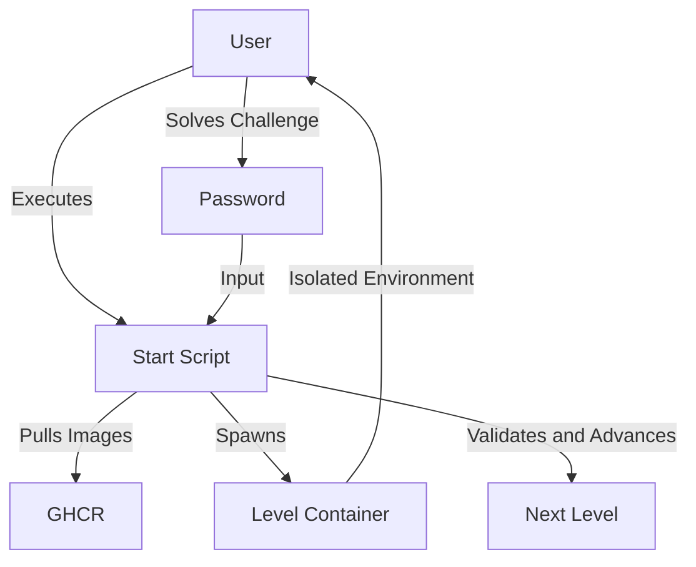

# Architecture

## System Overview

WARGAMES is a standalone, containerized Capture The Flag (CTF) game designed to run locally on the user's machine. Unlike traditional web-based CTF platforms, WARGAMES operates entirely via a shell script and Docker containers, ensuring isolation, safety, and zero infrastructure costs.

## Architecture Diagram



## Core Components

### 1. Start Script (`start.sh`)
The central controller of the game. It handles:

-   Game initialization and prerequisites checking.
-   Level management and progression.
-   Docker container lifecycle (pull, run, stop, remove).
-   User input and password validation.
-   State management.

### 2. Docker Containers
Each level is encapsulated in a Docker container. This provides:

-   **Safety**: Destructive commands inside the container do not affect the host machine.
-   **Consistency**: Every user gets the exact same environment.
-   **Isolation**: Challenges are self-contained.

### 3. Image Registry (GHCR)
Level images are hosted on GitHub Container Registry. The script pulls the specific image required for the current level on demand.

### 4. State Management
The game state (current level) is stateless on the server side (as there is no server). Progress is tracked via:

-   **Passwords**: Each level yields a password required to unlock the next.
-   **State Encoding**: Game state may be encoded in Base64 for portability or save codes.

## Game Flow

1.  **Initialization**: User runs `./start.sh`.
2.  **Image Pull**: The script pulls the Docker image for Level 1 from GHCR.
3.  **Container Spawn**: A container is started, dropping the user into a shell or specific environment.
4.  **Challenge**: User reads the `README` or instructions within the container.
5.  **Solution**: User completes the task to find the password for the next level.
6.  **Progression**: User exits the container (or inputs the password in the script menu) to proceed. The script validates the password and loads the next level's container.

## Security & Isolation

Since the game runs locally:

-   **Containerization**: Ensures that "rm -rf /" or other dangerous commands only destroy the temporary container, not the user's OS.

-   **Network**: The game does not require a backend or database connection. Internet is only required to pull the initial Docker images.

## File Structure

```
WARGAMES_2k24/
├── docs/                    # Documentation
├── -/                       # Helper scripts
│   ├── start.sh             # Internal start logic
│   └── start_exit.sh        # Exit handlers
├── start.sh                 # Main entry point
└── README.md                # Project overview
```
